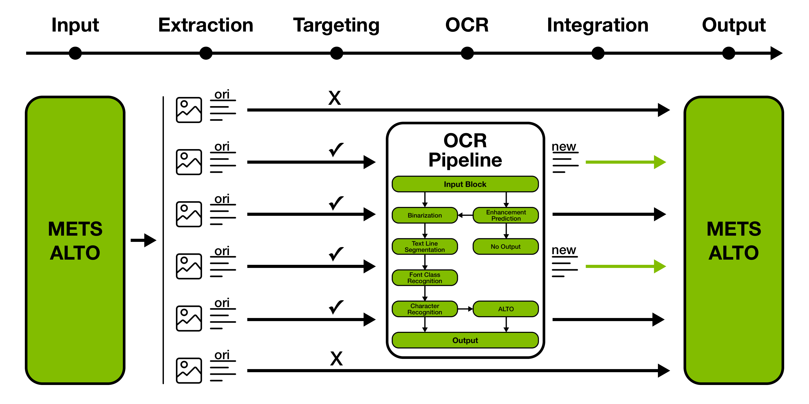
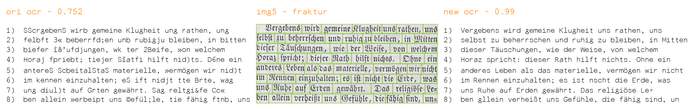

# Nautilus-OCR

The [National Library of Luxembourg](http://bnl.lu) (BnL) started its first initiative in digitizing newspapers, with layout recognition and OCR on article level, back in 2006.
Service providers were asked to create images of excellent quality, to run an optical layout recognition process, to identify articles and to run OCR on them. The data was modeled according to the [METS/ALTO](https://data.bnl.lu/data/historical-newspapers/mets-alto/) standard. In the meantime however, the potential of OCR software increased.

Developed by BnL in the context of its [Open Data](https://data.bnl.lu/) initiative, Nautilus-OCR uses these improvements in technology and the already structured data to rerun and enhance OCR. Nautilus-OCR can be used in two ways:


1. Main purpose: Enhance the OCR quality of original (ori) METS/ALTO packages.<br><br>
<br>
<sup>*Nautilus-OCR METS/ALTO to METS/ALTO pipeline:*</sup><br>
<sup>*- Extracts all ori images/text pairs*</sup><br>
<sup>*- Targets a specific set of block types*</sup><br>
<sup>*- Uses enhancement prediction on every target to possibly run OCR*</sup><br>
<sup>*- Integrates new outputs into an updated METS/ALTO package*</sup><br><br>
1. Alternatively: Use as a regular OCR engine that is applied on a set of images.<br><br>
<br>
<sup>*Nautilus-OCR provides the possibility to visually compare ori (left) to new (right) outputs.*</sup>


<br>
Key features:

* Custom model training.
* Included pre-trained OCR, font recognition and enhancement prediction models.
* METS/ALTO to METS/ALTO using enhancement prediction.
* Fast, multi-font OCR pipeline.

Nautilus-OCR is mainly built on open-source libraries combined with some proprietary contributions. Please note that the project is trying to be a generalized version of a tailored implementation for the specific needs of BnL.

# Table of Contents

* [Quick Start](#quick-start)
* [Requirements](#requirements)
* [Installation](#installation)
* [Workflow](#workflow)
* [Modules](#modules)
	* [ocr](#optical-character-recognition)
	* [seg](#text-line-segmentation)
	* [fcr](#font-class-recognition)
	* [epr](#enhancement-prediction)
* [Models](#models)
* [Ground Truth](#ground-truth)
* [Articles](#articles)
* [Libraries](#libraries)
* [License](#license)
* [Credits](#credits)
* [Contact](#contact)

# Quick Start

After having followed the [installation](#installation) instructions, Nautilus-OCR can be run by using the included BnL models and example METS/ALTO data.

With `nautilusocr/` as the current working directory, first copy the BnL models to the `final/` folder.<sup>1</sup>

	cp models/bnl/* models/final/

Next, run [enhance](#enhance) on the `examples/` directory, containg a single `mets-alto-package/`

	python3 src/main.py enhance -d examples/ -r 0.02

to generate new ALTO files for every block with a minimum enhancement prediction of 2%. Finally, the newly generated files can be located in `output/`.

<sup>1</sup> As explained in `models/final/README.md`, the models within `models/final/` are automatically applied when executing the **enhance**, **train-epr**, **ocr** and **test-ocr** actions. Models outside of `models/final/` are supposed to be stored for testing and comparison purposes.

# Requirements

Nautilus-OCR requires:

* **Linux / macOS**<br>
The software requires dependencies that only work on Linux and macOS.
Windows is not supported at the moment.
* **Python 3.8+**<br>
The software has been developed using Python 3.8.5.
* **Dependencies**<br>
Access to the libraries listed in `requirements.txt`.
* **METS/ALTO**<br>
METS/ALTO packages as data, or alternatively TextBlock images representing single-column snippets of text.

# Installation

With Python3 (tested on version 3.8.5) installed, clone this repostitory and install the required dependencies:

	git clone https://github.com/natliblux/nautilusocr
	cd nautilusocr
	pip3 install -r requirements.txt

Hunspell dependency might require:

	apt-get install libhunspell-dev
	brew install hunspell

OpenCV dependency might require:
	
	apt install libgl1-mesa-glx
	apt install libcudart10.1

You can test that all dependencies have been sucessfully installed by running

	python3 src/main.py -h
	
and looking for the following output:

```
Starting Nautilus-OCR

usage: main.py [-h] {set-ocr,train-ocr,test-ocr,enhance,ocr,set-fcr,train-fcr,test-fcr,test-seg,train-epr,test-epr} ...

Nautilus-OCR Command Line Tool

positional arguments:
  {set-ocr,train-ocr,test-ocr,enhance,ocr,set-fcr,train-fcr,test-fcr,test-seg,train-epr,test-epr}
                        sub-command help

optional arguments:
  -h, --help            show this help message and exit
```
# Workflow

The command-line tool consists of four different modules, with each one exposing a predefined set of actions:

* **[ocr](#optical-character-recognition)** - *optical character recognition*
* **[seg](#text-line-segmentation)** - *text line segmentation*
* **[fcr](#font-class-recognition)** - *font class recognition*
* **[epr](#enhancement-prediction)** - *enhancement prediction*

To get started, one should take note of the options available in `config.ini` and most importantly set the **device** (CPU/GPU) parameter and decide on the set of **font_classes** and **supported_languages**. Next, a general workflow could looks as follows:

1. Test the *seg* algorithm using **[test-seg](#test-seg)** to see whether any parameters need to be adjusted.
1. Create a *fcr* train set using **[set-fcr](#set-fcr)** based on font ground truth information.
1. Train a *fcr* model using **[train-fcr](#train-fcr)**.
1. Test the *fcr* model accurcy using **[test-fcr](#test-fcr)**.
1. Create an *ocr* train set using **[set-ocr](#set-ocr)** based on *ocr* ground truth information.
1. Train an *ocr* model for every font class using **[train-ocr](#train-ocr)**.
1. Test the *ocr* model for every font class using **[test-ocr](#test-ocr)**.
1. Train an *epr* model based on ground truth and ori data using **[train-epr](#train-epr)**.
1. Test the *epr* model accuracy using **[test-epr](#test-epr)**.
1. Enhance *METS/ALTO* packages using **[enhance](#enhance)**.
1. Alternatively: Run *ocr* on a set of images using **[ocr](#ocr)**.

This id done by calling `main.py` followed by the desired action and options:

	python3 src/main.py [action] [options]

The following module sections will list all available actions and options.

# Modules

## **optical character recognition**

### **set-ocr**
Creates an ocr train set consisting of image/text line pairs. Every pair is of type *New*, *Artificial* or *Existing*:

* *New*: Extracted using an image and ALTO file.
* *Generated*: Image part of pair is generated artificially based on given input text. 
* *Existing*: Pair exists already (has been prepared beforehand) and is included in the train set.

| Option| Default | Explanation |
| :-------------- | :------- | :---------- |
|-j --jsonl||Path to jsonl file referencing image and ALTO files <sup>1</sup> <sup>2</sup>|
|-c --confidence|9 (max tolerant)|Highest tolerated confidence value for every character in line|
|-m --model|fcr-model|Name of fcr model to be used in absence of font class indication <sup>3</sup>|
|-e --existing||Path to directory containing existing pairs <sup>4</sup> <sup>5</sup>|
|-g --generated|0 (none)|Number of artificially generated pairs to be added per font class <sup>6</sup> <sup>7</sup>|
|-t --text||Path to text file containing text for artificial pairs <sup>8</sup>|
|-n --nlines|-1 (max)|Maximum number of pairs per font class |
|-s --set|ocr-train-set|Name of ocr train set

<sup>1</sup> Example lines:

	{"image": "/path/image1.png", "gt": "/path/alto1.xml"}
	{"image": "/path/image2.png", "gt": "/path/alto2.xml", "gt-block-id": "TB1"}
	{"image": "/path/image3.png", "gt": "/path/alto3.xml", "gt-block-id": "TB2", "font": "fraktur"}

<sup>2</sup> Key **gt-block-id** can optionally reference a single block in a multi-block ALTO file.<br>
<sup>3</sup> Absence of **font** key means that -m option must be set to automatically determine the font class.<br>
<sup>4</sup> Naming convention for existing pairs: `[pair-name].png/.tif` & `[pair-name].gt.txt`.<br>
<sup>5</sup> Image part of existing pairs is supposed to be unbinarized.<br>
<sup>6</sup> Artificially generated lines represent lower quality examples for the model to learn from.<br>
<sup>7</sup> Fonts in `fonts/artificial/` are being randomly used and can be adjusted per font class.<br>
<sup>8</sup> Text is given by a `.txt` file with individual words delimited by spaces and line breaks.

### **train-ocr**

Trains an ocr model for a specific font using an ocr train set.

| Option | Default | Explanation |
| :-------------- | :------- | :---------- |
|**-s --set**||Name of ocr train set to be used|
|**-f --font**||Name of font that ocr model should be trained on|
|-m --model|ocr-model|Name of ocr model to be created|

### **test-ocr**

Tests models in `models/final/` on a test set defined by a jsonl file.<br>
A comparison to the original ocr data can optionally be drawn. 

| Option | Default | Explanation |
| :-------------- | :------- | :---------- |
|**-j --jsonl**||Path to jsonl file referencing image and ground truth ALTO files <sup>1</sup> <sup>2</sup>|
|-i --image|False|Generate output image comparing ocr output with source image|
|-c --confidence|False|Add ocr confidence (through font greyscale level) to output image|

<sup>1</sup> Example lines:<br>

	{"id": "001", "image": "/path/image1.png", "gt": "/path/alto1.xml"}
	{"id": "002", "image": "/path/image2.png", "gt": "/path/alto2.xml", "gt-block-id": "TB1"}
	{"id": "003", "image": "/path/image3.png", "gt": "/path/alto3.xml", "gt-block-id": "TB2", "ori": "/path2/alto3.xml"}
	{"id": "004", "image": "/path/image4.png", "gt": "/path/alto4.xml", "gt-block-id": "TB3", "ori": "/path2/alto4.xml", "ori-block-id": "TB4"}

<sup>2</sup> Keys **ori** and **ori-block-id** can optionally reference original ocr output for comparison purposes.

### **enhance**

Applies ocr on a set of original METS/ALTO packages, while aiming to enhance ocr accuracy.<sup>1</sup><br>
An optional enhancement prediction model can prevent running ocr for some target blocks.<br> 
Models in `models/final/` are automatically used for this action.<sup>2</sup>

| Option| Default | Explanation |
| :-------------- | :------- | :---------- |
|**-d --directory**||Path to directory containing all orignal METS/ALTO packages <sup>3</sup> <sup>4</sup>|
|-r --required|0.0|Value for minimum required enhancement prediction <sup>5</sup>|

<sup>1</sup> Target text block types can be adjusted in `config.ini`.<br>
<sup>2</sup> The presence of an epr model is optional.<br>
<sup>3</sup> METS files need to end in `-mets.xml`.<br>
<sup>4</sup> Every package name should be unique and is defined as the directory name of the METS file.<br>
<sup>5</sup> Enhancement predictions are in range [-1,1], set to -1 to disable epr and automatically reprocess all target blocks.<br>

### **ocr**

Applies ocr on a directory of images while using the models in `models/final/`.

| Option| Default | Explanation |
| :-------------- | :------- | :---------- |
|**-d --directory**||Path to directory containing target ocr source images <sup>1</sup>|
|-a --alto|False|Output ocr in ALTO format|
|-i --image|False|Generate output image comparing ocr with source image|
|-c --confidence|False|Add ocr confidence (through font greyscale level) to output image|

<sup>1</sup> Subdirectories possible, images should be in `.png` or `.tif` format.

## **text line segmentation**

### **test-seg**

Tests the CombiSeg segmentation algorithm on a test set defined by a jsonl file.
The correct functionning of the segmentation algorithm is essential for most other modules and actions.<br>
The default parameters should generally work well, however they can be adjusted. <sup>1</sup><br>
Explanations concerning the parameters, as well as the algorithm itself, can be found [here](https://jdmdh.episciences.org/8642).

| Option| Default | Explanation |
| :-------------- | :------- | :---------- |
|**-j --jsonl**||path to jsonl file referencing image and ALTO files <sup>2</sup>|

<sup>1</sup> Algorithm parameters can be adjusted in `config.ini` in case of unsatisfactory performance.<br>
<sup>2</sup> Example lines: 
	
	{"image": "/path/image1.png", "gt": "/path/alto1.xml"}
	{"image": "/path/image2.png", "gt": "/path/alto2.xml", "gt-block-id": "TB1"}

## **font class recognition**

### **set-fcr**

Creates a fcr train set consisting of individual character images.

| Option| Default | Explanation |
| :-------------- | :------- | :---------- |
|**-j --jsonl**||Path to jsonl file referencing image files and the respective font classes <sup>1</sup>|
|-n --nchars|max|Maximum number of characters extracted from every image <sup>2</sup>|
|-s --set|fcr-train-set|Name of fcr train set|

<sup>1</sup> Example line:
	
	{"image": "/path/image.png", "font": "fraktur"}

<sup>2</sup> Fewer extracted chars for a larger amount of images generally leads to a more diverse train set.

### **train-fcr**

Trains a fcr model using a fcr train set.

| Option| Default | Explanation |
| :-------------- | :------- | :---------- |
|**-s --set**||Name of fcr train set|
|-m --model|fcr-model|Name of fcr model to be created|

### **test-fcr**

Tests a fcr model on a test set defined by a jsonl file.

| Option| Default | Explanation |
| :-------------- | :------- | :---------- |
|**-j --jsonl**||Path to jsonl file referencing image files and the respective font classes <sup>1</sup>|
|-m --model|fcr-model|Name of fcr model to be tested|

<sup>1</sup> Example line: 

	{"image": "/path/image.png", "font": "fraktur"}

## **enhancement prediction**

This module requires language dictionaries. For all language **xx** in **supported_languages** in `config.ini`, please either add a list of words as `xx.txt` or the Hunspell files `xx.dic` and `xx.aff` to `dicts/`.

### **train-epr**

Trains an epr model (for use in [enhance](#enhance)) that predicts the enhancement in ocr accuracy (from ori to new) and can hence be used to prevent ocr from running on all target blocks.<br>
Please take note of the parameters in `config.ini` before starting training.<br>
This action uses the models in `models/final/`.

| Option| Default | Explanation |
| :-------------- | :------- | :---------- |
|**-j --jsonl**||Path to jsonl file referencing image, ground truth ALTO and original ALTO files <sup>1</sup>|
|-m --model|epr-model|Name of epr model to be created|

<sup>1</sup> Example lines: 
	
	{"image": "/path/image1.png", "gt": "/path/alto1.xml", "ori": "/path/alto1.xml", "year": 1859}
	{"image": "/path/image2.png", "gt": "/path/alto2.xml", "gt-block-id": "TB1", "ori": "/path/alto2.xml", "year": 1859}
	{"image": "/path/image3.png", "gt": "/path/alto3.xml", "gt-block-id": "TB2", "ori": "/path/alto3.xml", "ori-block-id": "TB2", "year": 1859}

### **test-epr**

Tests an epr model and returns the mean average error after applying leave-one-out cross-validation (kNN algorithm). 

| Option| Default | Explanation |
| :-------------- | :------- | :---------- |
|-m --model|epr-model|Name of epr model to be tested|

# Models

Nautilus-OCR encloses four pre-trained models:

* **bnl-ocr-antiqua.mlmodel**

OCR model built with *kraken* and trained on the antiqua data (70k pairs) of an extended version of [**bnl-ground-truth-newspapers-before-1878**](#ground-truth) that is not limited to the cut-off date of 1878. 

* **bnl-ocr-fraktur.mlmodel**

OCR model built with *kraken* and trained on the fraktur data (43k pairs) of an extended version of [**bnl-ground-truth-newspapers-before-1878**](#ground-truth) that is not limited to the cut-off date of 1878. 

* **bnl-fcr.h5**

Binary font recognition model built with *TensorFlow* and trained to perform classification using font classes *[antiqua, fraktur]*. Please note that the fcr module automatically extends the set of classes to *[antiqua, fraktur, unknown]*, to cover for the case where the neural network input preprocessing fails. The model has been trained on 50k individual character images and showed 100% accuracy on a 200 image test set.

* **bnl-epr-de-fr-lb.jsonl**

Enhancement prediction model trained on more than 4.5k text blocks for the language set *[de, fr, lb]*. Training data has been published between 1840 and 1960. Enhancement is predicted for the application of **bnl-ocr-antiqua.mlmodel** and **bnl-ocr-fraktur.mlmodel**, therefore based on font class set *[antiqua, fraktur]*. The model makes use of the dictionaries for all three languages within `dicts/`. Using leave-one-out cross-validation (kNN algorithm), mean average error of 0.024 was achieved.

# Ground Truth

[**bnl-ground-truth-newspapers-before-1878**](https://data.bnl.lu/data/historical-newspapers/)<br>

OCR ground truth dataset including more than 33k text line image/text pairs, split in antiqua (19k) and fraktur (14k) font classes. The set is based on Luxembourg historical newspapers in the public domain (published before 1878), written generally in German, French and Luxembourgish. Transcription was done using a double-keying technique with a minimum accuracy of 99.95%. Font class was automatically determined using **bnl-fcr.h5**.

# Articles

[**Combining Morphological and Histogram based Text Line Segmentation in the OCR Context**](https://jdmdh.episciences.org/8642)  
Journal of Data Mining & Digital Humanities  
  
*Text line segmentation is one of the pre-stages of modern optical character recognition systems. The algorithmic approach proposed by this paper has been designed for this exact purpose. Its main characteristic is the combination of two different techniques, morphological image operations and horizontal histogram projections. The method was developed to be applied on a historic data collection that commonly features quality issues, such as degraded paper, blurred text, or presence of noise. For that reason, the segmenter in question could be of particular interest for cultural institutions, that want access to robust line bounding boxes for a given historic document. Because of the promising segmentation results that are joined by low computational cost, the algorithm was incorporated into the OCR pipeline of the National Library of Luxembourg, in the context of the initiative of reprocessing their historic newspaper collection. The general contribution of this paper is to outline the approach and to evaluate the gains in terms of accuracy and speed, comparing it to the segmentation algorithm bundled with the used open source OCR software.*

[**Rerunning OCR: A Machine Learning Approach to Quality Assessment and Enhancement Prediction**](https://jdmdh.episciences.org/10239)  
Journal of Data Mining & Digital Humanities  
  
*Iterating with new and improved OCR solutions enforces decision making when it comes to targeting the right candidates for reprocessing. This especially applies when the underlying data collection is of considerable size and rather diverse in terms of fonts, languages, periods of publication and consequently OCR quality. This article captures the efforts of the National Library of Luxembourg to support those targeting decisions. They are crucial in order to guarantee low computational overhead and reduced quality degradation risks, combined with a more quantifiable OCR improvement. In particular, this work explains the methodology of the library with respect to text block level quality assessment. Through extension of this technique, a regression model, that is able to take into account the enhancement potential of a new OCR engine, is also presented. They both mark promising approaches, especially for cultural institutions dealing with historical data of lower quality.*

[**Nautilus - An End-To-End METS/ALTO OCR Enhancement Pipeline**](https://liberquarterly.eu/article/view/13330)  
LIBER Quarterly  
  
*When a digital collection has been processed by OCR, the usability expectations of patrons and researchers are high. While the former expect full text search to return all instances of terms in historical collections correctly, the latter are more familiar with the impacts of OCR errors but would still like to apply big data analysis or machine-learning methods. All of these use cases depend on high quality textual transcriptions of the scans. This is why the National Library of Luxembourg (BnL) has developed a pipeline to improve OCR for existing digitised documents. Enhancing OCR in a digital library not only demands improved machine learning models, but also requires a coherent reprocessing strategy in order to apply them efficiently in production systems. The newly developed software tool, Nautilus, fulfils these requirements using METS/ALTO as a pivot format. The BnL has open-sourced it so that other libraries can re-use it on their own collections. This paper covers the creation of the ground truth, the details of the reprocessing pipeline, its production use on the entirety of the BnL collection, along with the estimated results. Based on a quality prediction measure, developed during the project, approximately 28 million additional text lines now exceed the quality threshold.*

# Libraries

Nautilus-OCR is mostly built on open-source libraries, with the most important ones being:

* kraken : http://kraken.re/
* TensorFlow : https://www.tensorflow.org/
* openCV : https://opencv.org/

# License

[](https://www.gnu.org/licenses/gpl-3.0)

See `COPYING` to see full text.

# Credits

Thanks and credits go to the [Lexicolux project](https://infolux.uni.lu/worterbucher/), whose work is the basis for the generation of `dicts/lb.txt`.

# Contact

If you want to get in touch, please contact us [here](https://data.bnl.lu/contact/).